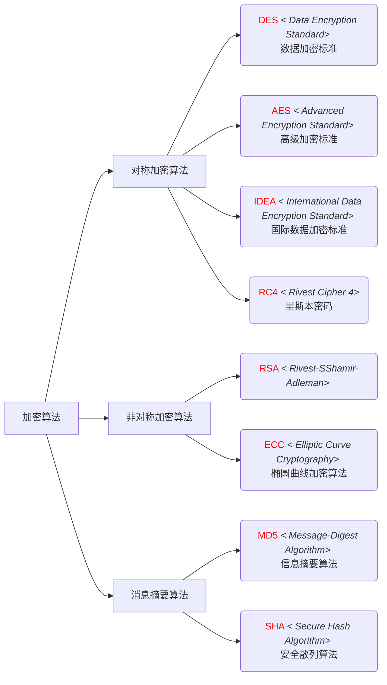

# 流

```mermaid
graph LR
加密算法 -->对称加密算法-->D(<font color=red>DES</font> <i>< Data Encryption Standard> </i><br/>数据加密标准)
           对称加密算法-->E(<font color=red>AES</font> <i>< Advanced Encryption Standard> </i><br/>高级加密标准)
           对称加密算法-->F(<font color=red>IDEA</font> <i>< International Data Encryption Standard> </i><br/>国际数据加密标准)
           对称加密算法-->G(<font color=red>RC4</font> <i>< Rivest Cipher 4> </i><br/>里斯本密码)

加密算法 -->非对称加密算法-->A(<font color=red>RSA</font> <i>< Rivest-SShamir-Adleman> </i><br/>)

            非对称加密算法-->B(<font color=red>ECC</font> <i>< Elliptic Curve Cryptography> </i><br/>椭圆曲线加密算法)

加密算法 -->消息摘要算法-->H(<font color=red>MD5</font> <i>< Message-Digest Algorithm> </i><br/>信息摘要算法)
            消息摘要算法-->I(<font color=red>SHA</font> <i>< Secure Hash Algorithm> </i><br/>安全散列算法)
```

# 代理

这个的第一版笔记见
# 反射

# 注解
